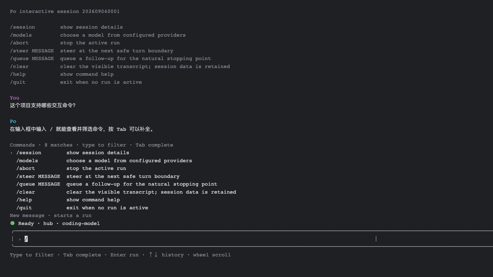

# Po Agent Go

Po Agent是我基于Pi Agent，用Go仿写的一个 Agent 学习项目。

写它主要是为了个人学习，弄清楚模型调用、工具执行、上下文管理、会话持久化和终端交互等知识点。

项目目前可以作为命令行编程助手使用，也可以把根目录的 `po` 包当作一个个人学习的小型 Agent运行库。代码目前已经实现了完整的可用版本，后面可能会基于dsh再做一些优化，以及其他功能补充。

## 目前包含的功能

- 兼容 OpenAI Chat Completions 接口，可以配置多个兼容供应商并在交互界面切换模型。
- 支持流式文本、推理内容和工具调用。
- 工具参数通过 JSON Schema 校验。
- 支持串行和并行工具调用。
- 文件工具只能访问指定工作区，并用 SHA-256 避免覆盖已经变化的文件。
- 写文件、Git、Go 和 Shell 命令执行前需要确认。
- 运行中可以追加即时引导，也可以把下一条消息排队。
- 会话使用 JSONL 追加保存，启动时可以处理宕机留下的不完整文件尾。
- 带有简单的重试、超时、运行限制和上下文裁剪实现。

## 运行环境

- Go 1.25.13 或更高版本。
- 一个兼容 OpenAI Chat Completions 的模型接口。
- 如果要使用编程工具，模型需要支持结构化工具调用。

仓库的 `go.mod` 会为本地开发选择 Go 1.26.4。

## 构建

在项目目录中执行：

```sh
go build -o ./bin/po ./cmd/po
./bin/po version
```

仓库发布后也可以通过 `go install` 安装：

```sh
go install github.com/lemonzjj/po-agent-go/cmd/po@latest
```

如果安装后找不到 `po`，请把 Go 的命令安装目录加入 `PATH`：

```sh
export PATH="$(go env GOPATH)/bin:$PATH"
```

## 配置

Po 只要求用户提供供应商名称、Base URL、模型 ID 和 API 密钥。供应商名称是本地别名，可以自行命名。

先创建全局配置：

```sh
po config init \
  --provider hub \
  --base-url https://your-endpoint.example/v1 \
  --model your-model-id

export PO_API_KEY='your-api-key'
po doctor
```

API 密钥只从环境变量读取，不会写入配置文件。默认变量名是 `PO_API_KEY`。

### 多供应商

可以继续向同一份配置添加供应商。不同供应商建议使用不同的密钥环境变量：

```sh
po config add-provider \
  --name backup \
  --base-url https://another-endpoint.example/v1 \
  --api-key-env BACKUP_API_KEY

export BACKUP_API_KEY='your-backup-api-key'
po doctor --provider backup --model your-model-id
```

查看配置、查询供应商的模型列表，或直接切换默认模型：

```sh
po config show
po config models --provider backup
po config use --provider backup your-model-id
```

`po config models` 会请求供应商的 `/models` 接口。某些兼容服务只返回模型 ID，此时缺失的上下文窗口和输出上限会显示为 `-`，运行时使用 Po 的内置默认值。

在交互界面输入 `/models` 会并行读取所有已配置供应商的模型，并按供应商分组展示。选择器支持搜索、方向键、鼠标滚轮和当前模型标记。切换不会丢失当前会话，新版配置也会记住最后的选择；已经在运行的任务需要先结束或中止。

早期的单模型配置仍然可以读取。如果需要添加供应商或持久化模型切换，先执行：

```sh
po config migrate --provider hub
```

迁移前的配置会保存为同目录下的 `config.json.legacy.bak`。所有配置子命令可通过 `po config --help` 查看。

启动时还会识别下面几个环境变量：

- `PO_CONFIG`：改变全局配置文件的位置。
- `PO_BASE_URL`：临时覆盖当前供应商的地址。
- `PO_MODEL`：临时覆盖启动时使用的模型 ID。
- `PO_API_KEY`：为使用默认密钥变量名的供应商提供密钥。

## 使用



启动交互界面：

```sh
po
```

只执行一条指令：

```sh
po -p "解释这个仓库"
```

允许修改工作区文件：

```sh
po --allow-write
```

如果还需要使用不受限的 Shell：

```sh
po --allow-write --allow-shell
```

交互模式支持这些命令：

```text
/session       查看当前会话
/models        选择供应商和模型
/abort         终止当前任务
/steer X       在下一轮模型调用前加入即时引导
/queue X       把消息排到当前任务之后
/clear         清空屏幕上的对话
/help          查看帮助
/quit          退出
```

在输入框中输入 `/` 可查看并过滤交互命令，按 `Tab` 补全当前的第一个匹配项。任务运行时，未显示命令提示时按 `Tab` 切换即时引导和排队模式。方向键 `↑/↓` 切换历史输入；鼠标滚轮、`Page Up` 和 `Page Down` 滚动对话记录。

## 项目配置

Po 会读取 `AGENTS.md`、`AGENTS.override.md` 和 `CLAUDE.md` 等项目说明文件。

项目中的 `.po/config.json` 可以选择全局配置中已存在的供应商和模型，也可以覆盖模型地址与运行参数。项目配置不能保存 API 密钥。因此第一次使用时需要先确认是否信任这个目录：

```json
{
  "provider": "backup",
  "model": "your-model-id",
  "max_output_tokens": 8192
}
```

项目配置切换到非当前供应商时，需要同时指定 `model`。

```sh
po trust status --workspace .
po trust allow --workspace .
po trust deny --workspace .
```

## 会话恢复

交互会话保存在当前用户配置目录下的 `po/sessions` 中。可以继续最近一次会话，也可以打开指定的 JSONL 文件：

```sh
po --continue
po --session /path/to/session.jsonl
```

交互会话默认为每个 Session 创建独立的 `ContextBuilder`。JSONL 仍保留完整原始对话；当估算的 token 超出当前模型窗口时，只对发给模型的上下文视图做分段摘要。切换模型会按新模型的窗口重建该策略。

如果程序在一轮任务中间退出，Po 不会猜测已经调用的工具是否真正执行成功。检查工作区后，可以手动记录恢复结果：

```sh
po session inspect --file /path/to/session.jsonl
po session recover --file /path/to/session.jsonl --note "已检查工作区"
```

JSONL 最后一行只写了一部分时，重新打开会话会丢弃这段不完整内容；已经完整写入但格式错误的记录会直接报错。

## 代码目录

- 根目录：Agent 循环、消息、模型和工具接口。
- `cmd/po`：命令行和交互终端。
- `provider/openai`：兼容 OpenAI 接口的模型实现。
- `internal/appconfig`：全局与项目配置的读取、验证和迁移。
- `internal/modelcatalog`：通过供应商的 `/models` 接口发现模型。
- `tool/coding`：读写文件、搜索、Git、Go 和 Shell 工具。
- `workspace`：工作区文件访问限制。
- `session/jsonl`：会话记录与恢复。
- `contextwindow`：上下文裁剪和摘要。
- `guard`、`policy`：运行限制和工具审批。

`examples/scripted_conversation` 中有一个不需要真实模型接口的完整示例。

## 测试

```sh
./scripts/verify.sh
```

该脚本会检查代码格式、模块依赖、普通测试、竞态问题和 `go vet`。

仓库还包含一项默认跳过的真实模型多次压缩质量测试。它会消耗真实 token，只在显式提供 `PO_LIVE_CONTEXT_TEST=1` 以及 `PO_LIVE_BASE_URL`、`PO_LIVE_MODEL`、`PO_LIVE_API_KEY` 时运行：

```sh
go test -v ./cmd/po -run TestLiveRepeatedContextCompressionQuality
```

## 注意

Po 的文件工具会限制路径，但整个程序并不是沙箱。Git、Go 和 Shell 都可能执行项目中的程序或配置。不要在不信任的仓库里直接批准这些操作。

## 许可证

MIT，见 `LICENSE`。
